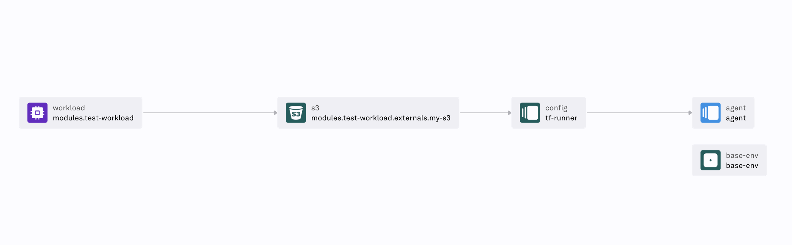

# Humanitec Setup Wizard

`humanitec-setup-wizard` is a CLI wizard designed to help you easily connect one of your clusters to the [Humanitec Platform Orchestrator](https://developer.humanitec.com/platform-orchestrator/overview).

Given a [Humanitec organization](https://developer.humanitec.com/concepts/organizations/) and an existing Kubernetes cluster, the wizard will do the following:
  - Connect your [cloud account](https://developer.humanitec.com/platform-orchestrator/security/cloud-accounts/overview/) to Humanitec
  - Create and configure [resource definitions](https://developer.humanitec.com/platform-orchestrator/resources/resource-definitions/) for:
  - A [Kubernetes cluster](https://developer.humanitec.com/integration-and-extensions/containerization/kubernetes/)
- Configure a secret store for [secret references](https://developer.humanitec.com/platform-orchestrator/security/secret-references/)
- Configure infrastructure & resource definitions required for a [Terraform Runner](https://developer.humanitec.com/integration-and-extensions/drivers/generic-drivers/terraform-runner/)
- Create a test application, with a resource graph similar to this:
  

By default, the wizard will install the following on your Kubernetes cluster, creating a dedicated namespace for each:
- [Humanitec Agent](https://developer.humanitec.com/integration-and-extensions/humanitec-agent/overview/): a secure and easy-to-administer way for the Orchestrator to access private endpoints in your infrastructure.
- [Humanitec Operator](https://developer.humanitec.com/integration-and-extensions/humanitec-operator/overview/): a Kubernetes operator that controls deployments made with the Orchestrator, capable of and responsible for provisioning the required secret resources in the cluster.

By default, the wizard will create the following resources in your cloud infrastructure, if they do not exist:
- Identity and access resources to connect the cluster to Humanitec, as well as resources required to use temporary credentials for the cloud account (specifics vary by provider)
- A secret store (in the Platform Orchestrator)
- To allow the [Terraform Runner Driver](https://developer.humanitec.com/integration-and-extensions/drivers/generic-drivers/terraform-runner/) execute the Terraform code in the specified cluster:
  - A Kubernetes Namespace where the Terraform Runner runs
  - A Kubernetes Service Account with which the Terraform Runner runs
  - A Kubernetes Role bound to the Terraform Runner Service Account that enables it to deal with the needed resources.

After successfully running the wizard, you will have a configured and working application in the Platform Orchestrator. You can reuse many aspects of its configuration to add other applications to Humanitec. As a suggested next step, check out our [in-cluster resource packs](https://developer.humanitec.com/examples/resource-packs/?cloud=in-cluster).

This tool supports infrastructure hosted in AWS, Azure, and Google Cloud. To set up Humanitec in other environments, please [reach out to our support team](https://developer.humanitec.com/support/contact/).

## Prerequisites

- A cloud account with appropriate permissions and the local cloud CLI (`aws`, `az`, or `gcloud`) authenticated
- A Kubernetes cluster in your target cloud with its API server endpoint accessible from your shell
- (optional) A secret store in your target cloud. Can be one of AWS Secrets Manager, Azure Key Vault, or Google Cloud Secret Manager
- A Humanitec account with Administrator permissions
- `humctl`, the Humanitec CLI: https://developer.humanitec.com/platform-orchestrator/cli/

    If you prefer not to use `humctl`, the wizard will prompt you to provide your Humanitec API token directly during the setup process. See our [Authentication documentation](https://developer.humanitec.com/platform-orchestrator/reference/api-references/#authentication) for specifics.

## Installation

### Install with Homebrew (MacOS or Linux)

1. Install the tap repository

    ```bash
    brew tap humanitec-architecture/setup-wizard https://github.com/humanitec-architecture/setup-wizard
    ```

2. Install the binary

    ```bash
    brew install humanitec-setup-wizard
    ```

### Install from pre-built binaries

1. View the latest Github Releases: https://github.com/humanitec-architecture/setup-wizard/releases.
2. Download the binary appropriate for your platform from the latest release.

### Install from source

_Requires go 1.22.5 or later._

1. Clone this repository:

    ```bash
    git clone https://github.com/humanitec-architecture/setup-wizard.git
    cd setup-wizard
    ```

2. Build the CLI wizard:

    ```bash
    go build -o humanitec-setup-wizard
    ```

## Usage

### Running the wizard

Log in to Humanitec using `humctl`:

```bash
humctl login
```

Run the wizard:

```bash
./humanitec-setup-wizard connect
```

The wizard will guide you through the process of connecting your cloud infrastructure to Humanitec.

## Cleaning up

To clean up resources created through previous runs of the wizard, run:

```bash
./humanitec-setup-wizard clean
```

As state is stored locally, the `clean` command must be executed on the same system which previously ran the wizard.

## Applying resource pack definitions

To automatically install the in-cluster resource definitions described in this [resource pack](https://github.com/humanitec-architecture/resource-packs-in-cluster), run:

```bash
./humanitec-setup-wizard install-resource-pack
```

## Provider Documentation: AWS

### Authentication

The wizard requires AWS credentials to connect your AWS cloud infrastructure.

#### Using Default AWS CLI Profile

If you have already configured the AWS CLI with a default profile, the wizard will automatically detect and use it.

#### Using a Specific AWS Profile

You can specify a different AWS profile by setting the `AWS_PROFILE` environment variable:

```bash
export AWS_PROFILE=your_profile_name
```

#### Using Environment Variables

You can also provide AWS credentials directly through environment variables:

```bash
export AWS_ACCESS_KEY_ID=your_access_key_id
export AWS_SECRET_ACCESS_KEY=your_secret_access_key
export AWS_REGION=your_region
```

### Minimum Required AWS Permissions

The following AWS permissions are required for humanitec-setup-wizard to successfully connect and manage your AWS infrastructure:

```json
{
    "Version": "2012-10-17",
    "Statement": [
        {
            "Effect": "Allow",
            "Action": [
                "iam:ListAttachedRolePolicies",
                "iam:GetRole",
                "iam:GetPolicy",
                "iam:CreateRole",
                "iam:CreatePolicy",
                "iam:AttachRolePolicy",
                "iam:PassRole",
                "eks:ListClusters",
                "eks:ListAssociatedAccessPolicies",
                "eks:ListAccessEntries",
                "eks:DescribeCluster",
                "eks:DescribeAccessEntry",
                "eks:CreateAccessEntry",
                "eks:CreatePodIdentityAssociation",
                "eks:AssociateAccessPolicy",
                "eks:DescribePodIdentityAssociation",
                "eks:DescribePodIdentityAssociation",
                "sts:AssumeRole",
                "elasticloadbalancing:DescribeLoadBalancers"
            ],
            "Resource": "*"
        }
    ]
}
```

These permissions allow the wizard to perform necessary actions such as creating roles, managing policies, and interacting with EKS clusters.

In addition, to install the Humanitec Operator and/or Agent, you will need deploy permissions access to the cluster you want to connect to Humanitec.

### Cluster and Project Prerequisites

The CLI wizard assumes that:

- An [Ingress Controller](https://developer.humanitec.com/integration-and-extensions/networking/ingress-controllers/) is available in the target cluster
- The [Amazon EKS Pod Identity Agent](https://docs.aws.amazon.com/eks/latest/userguide/pod-id-agent-setup.html) is enabled in the selected cluster

### Resources Created

During the execution of the wizard, the following resources resources will be created in AWS / Kubernetes / Platform Orchestrator:

- An AWS IAM Role named `humanitec-access-tempcreds-<uuid>` to perform [AWS Role Assumption](https://developer.humanitec.com/platform-orchestrator/security/cloud-accounts/aws/#aws-role-assumption)
- A Cloud Account in the Platform Orchestrator using that role
- An AWS IAM Policy named `humanitec-access-eks-<cluster-name>-<uuid>` defining the access permissions to the cluster, attached to the IAM Role
- A Kubernetes `ClusterRole` named `humanitec-deploy-access` on the target cluster, which is bound to the IAM Role impersonated by the Platform Orchestrator via a `ClusterRoleBinding` named `humanitec-deploy-access`
- An EKS Access Entry for the IAM Role
- An [EKS Cluster Humanitec Resource Definition](https://developer.humanitec.com/integration-and-extensions/containerization/kubernetes/#3-create-an-eks-resource-definition)
- Humanitec Operator and Humanitec Agent are installed in the EKS cluster via Helm charts
  - An AWS IAM Role named `humanitec-operator-sa-<uuid>` for the Operator Pod Identity
  - An AWS IAM Policy named `secrets-manager-access-<uuid>` for Operator access to AWS Secrets Manager, associated to the IAM Role
  - A Pod Identity association for the role on the cluster
  - A Secret Store in the Platform Orchestrator and on the cluster
- To let the [Terraform Runner Driver](https://developer.humanitec.com/integration-and-extensions/drivers/generic-drivers/terraform-runner/) execute Terraform code in the specified cluster:
  - A Kubernetes Namespace where the Terraform Runner runs
  - A Kubernetes Service Account the Terraform Runner runs with
  - A Kubernetes Role bound to the Terraform Runner Service Account to enable it to deal with the needed resources
  - Resource Definitions in the Platform Orchestrator for a fake Resource and the Runner config

The CLI wizard outputs the name of all resources generated and stores them in the state session.

To remove the resources created, see [cleaning up](#cleaning-up).

## Provider Documentation: GCP

### Authentication

The CLI wizard requires that the [Application Default Credentials](https://cloud.google.com/docs/authentication/provide-credentials-adc) have been set up.

### Minimum Required GCP Permissions

The [Service Account impersonated by the Application Default Credentials](https://cloud.google.com/docs/authentication/provide-credentials-adc#sa-impersonation) or the User associated to them, should have the following roles:

- roles/serviceusage.serviceUsageViewer
- roles/iam.workloadIdentityPoolAdmin
- roles/iam.serviceAccountAdmin
- roles/container.admin
- roles/iam.roleAdmin
- roles/resourcemanager.projectIamAdmin

### Cluster and Project Prerequisites

The CLI wizard assumes that:

- In the target cluster an [Ingress Controller](https://developer.humanitec.com/integration-and-extensions/networking/ingress-controllers/) is available
- The [Secret Manager API](https://cloud.google.com/secret-manager/docs/configuring-secret-manager) is enabled in the selected GCP Project
- The target cluster has [Workload Identity Enabled](https://cloud.google.com/kubernetes-engine/docs/how-to/workload-identity)

### Resources Created

During the execution of the wizard, the following resources resources will be created in  GCP / Kubernetes:

- To perform [GCP Service account impersonation](https://developer.humanitec.com/platform-orchestrator/security/cloud-accounts/gcp/#gcp-service-account-impersonation):
  - A Workload Identity Pool and a Workload Identity Provider
  - An IAM Service Account which will be impersonated by Humanitec
  - A Policy binding between the IAM Service Account and the Workload Identity Federation
- To [connect a GKE Cluster](https://developer.humanitec.com/integration-and-extensions/containerization/kubernetes/#gke) via Kubernetes Cluster role + IAM cluster access custom role:
  - An IAM Custom Role that is assigned to the IAM Service Account impersonated by Humanitec
  - A Kubernetes Cluster Role on the target cluster, which is bound to the IAM Service Account impersonated by Humanitec
  - A [GKE Cluster Humanitec Resource Definition](https://developer.humanitec.com/integration-and-extensions/containerization/kubernetes/#3-create-a-gke-resource-definition)
- To let the [Terraform Runner Driver](https://developer.humanitec.com/integration-and-extensions/drivers/generic-drivers/terraform-runner/) execute Terraform code in the specified cluster:
  - A Kubernetes Namespace where the Terraform Runner runs
  - A Kubernetes Service Account the Terraform Runner runs with
  - A Kubernetes Role bound to the Terraform Runner Service Account to enable it to deal with the needed resources
  - Resource Definitions in the Platform Orchestrator for a fake Resource and the Runner config

The CLI wizard outputs the name of every GCP resources generated and stores them in the state session.

To remove the resources created, see [cleaning up](#cleaning-up).

## Provider Documentation: Azure

### Authentication

The CLI wizard requires you to be authenticated to Azure. The common way is to use [Azure CLI](https://learn.microsoft.com/en-us/cli/azure/authenticate-azure-cli) for this.

### Minimum Required Azure Permissions

The Service Principle running the wizard should have the following Azure/Entra ID Roles:

- Azure User Access Administrator
- Azure Kubernetes Service Cluster User
- Entra ID Privileged Role Administrator

Also, there should be sufficient RBAC permissions in the AKS cluster to install Operator and Agent helm charts and create `ClusterRole` and `ClusterRoleBinding`.

### Cluster and Project Prerequisites

The CLI wizard assumes that:

- In the target cluster an [Ingress Controller](https://developer.humanitec.com/integration-and-extensions/networking/ingress-controllers/) is available
- An [Azure Key Vault](https://learn.microsoft.com/en-us/azure/key-vault/general/) has been created in your Subscription.

### Resources Created

- Managed Identity (default name `humanitec-account-identity`) and Federated Credentials to associate with Humanitec Cloud Account.
- `Azure Kubernetes Service Cluster User Role` Assignment for this Managed Identity.
- Entra ID security group (default name `humanitec-sec-group`) to set up workload identity in the AKS cluster. The managed identity is added as member of this group.
- `Azure Kubernetes Service Cluster User Role` Assignment for this Entra ID Group.
- `ClusterRole` and `ClusterRoleBinding` objects (default name `humanitec-deploy-access`) in the AKS cluster to set up RBAC and workload identity binding.
- Humanitec Operator and Humanitec Agent are installed in the AKS cluster via Helm charts.
- Managed Identity (default name `humanitec-operator-identity`) and Federated Credentials to use workload identity to access Azure Key Vault from Humanitec Operator.
- To let the [Terraform Runner Driver](https://developer.humanitec.com/integration-and-extensions/drivers/generic-drivers/terraform-runner/) execute Terraform code in the specified cluster:
  - A Kubernetes Namespace where the Terraform Runner runs
  - A Kubernetes Service Account the Terraform Runner runs with
  - A Kubernetes Role bound to the Terraform Runner Service Account to enable it to deal with the needed resources
  - Resource Definitions in the Platform Orchestrator for a fake Resource and the Runner config

The CLI wizard outputs the name of every Azure resource generated and stores them in the state session.

To remove the resources created, see [cleaning up](#cleaning-up).

## Test Application

As an optional step, a test application can be deployed via Humanitec. This application consists of a container that runs the [nginx image](https://hub.docker.com/_/nginx) in the alpine version. It exposes the internal port 80 on port 8080.

## Known Issues

* During initial configuration of your cloud account, you may receive an error about role assumption (e.g.: error code `CRED-005`). To work around the issue, wait ~10 seconds and restart the wizard using state from the previous session.

## Contact

For questions about this wizard, please reach out to our support team or via [GitHub Issues](https://github.com/humanitec-architecture/setup-wizard/issues).

## License & Copyright

&copy; 2024– Humanitec

Source code for this project is released under the Microsoft Reference Source License (MS-RSL).
